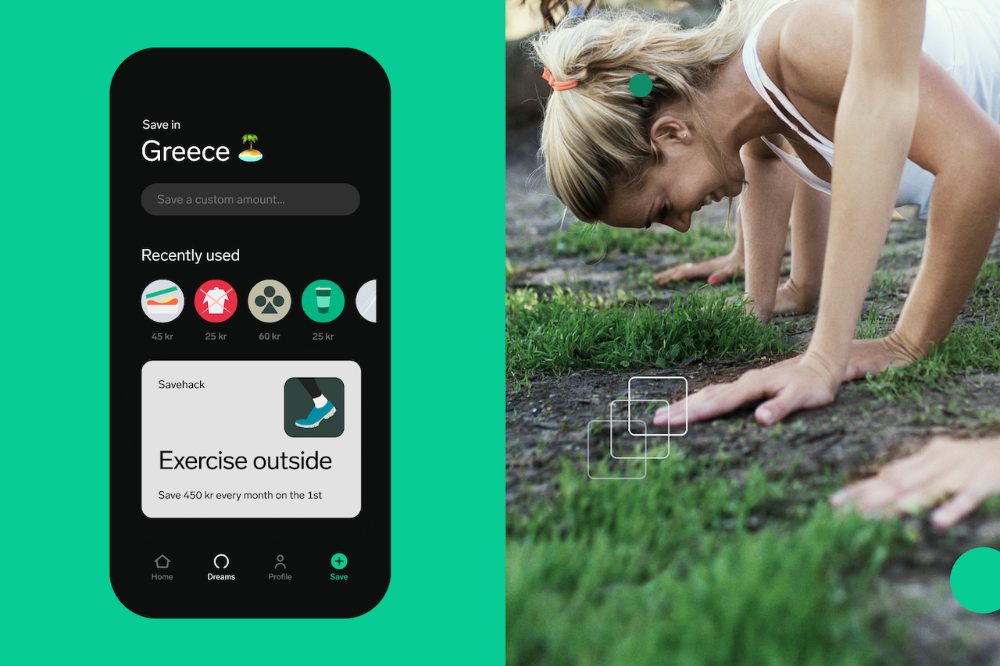

# Dreams Android SDK



## Requirements

* Minimum Android SDK version: 21
* Java source and target compatibility version: 1.8

## Installation

Register the maven repository by adding it to your project build.gradle.

```groovy
allprojects {
    repositories {
        mavenCentral()
    }
}
```

Add the library to your module dependencies.

```groovy
dependencies {
    implementation 'com.getdreams:android-sdk:0.7.0'
}
```

## Usage

Before using any other part of the SDK you must call `Dreams.configure()`. This can be done in `Application.onCreate()`.

```kotlin
class ExampleApp : Application() {
    override fun onCreate() {
        super.onCreate()
        Dreams.configure(Dreams.Configuration(clientId = "clientId", baseUrl = "https://getdreams.io"))
    }
}
```

To show Dreams simply add `DreamsView` to a layout, and then call `DreamsView.launch()`.
To handle possible errors during launch you can send a `OnLaunchCompletion` to `DreamsView.launch()` that will be invoked with the result of the launch.

```xml
<com.getdreams.views.DreamsView
    android:id="@+id/dreams"
    android:layout_width="match_parent"
    android:layout_height="match_parent" />
```

```kotlin
val dreamsView: DreamsView = findViewById<DreamsView>(R.id.dreams)
dreamsView.launch(Dreams.Credentials(idToken = "user token"), Locale.ENGLISH) { result ->
    when (result) {
        is Result.Success -> {
            // Dreams was launched successfully
        }
        is Result.Failure -> {
            when (val err = result.error) {
                is LaunchError.InvalidCredentials -> {
                    // The provided credentials were invalid
                }
                is LaunchError.HttpError -> {
                    // The server returned a HTTP error code
                }
                is LaunchError.UnexpectedError -> {
                    // Something went wrong when trying to open a connection to Dreams
                }
            }
        }
    }
}
```

Note as the dreams view can trigger showing the IME, e.g. a soft keyboard, it needs to be resized so the IME does not cover part of the dreams view.
The easiest way to achieve this is to flag the activity as `adjustResize`.

```xml
<activity
    android:name=".Example"
    android:windowSoftInputMode="adjustResize"/>
```

### Location

If you want to launch dreams at a specific location you need to send a `location` to `DreamsView.launch`.

```kotlin
val dreamsView: DreamsView = findViewById<DreamsView>(R.id.dreams)
dreamsView.launch(Dreams.Credentials(idToken = "user token"), Locale.ENGLISH, location = "/path/to/location") { _ -> }
```

When the dreams view is already active the `DreamsView.navigateTo()` function can be used instead.

```kotlin
val dreamsView: DreamsView = findViewById<DreamsView>(R.id.dreams)
dreamsView.navigateTo(location = "/path/to/location")
```

### Events

In order to listen for events from Dreams you need to register a listener on the DreamsView.

```kotlin
dreamsView.registerEventListener { event ->
    when (event) {
        is Event.Telemetry -> { /* Use telemetry event */ }
    }
}
```

#### Token renewal

When a token requires renewal a `CredentialsExpired` event will be sent, to set a new token you need to call
 `DreamsView.updateCredentials` with the request id from the event and the new token.

 ```kotlin
dreamsView.registerEventListener { event ->
    when (event) {
        is Event.CredentialsExpired -> {
            val newToken = getValidToken()
            dreamsView.updateCredentials(requestId = event.requestId, credentials = Credentials(idToken = newToken))
        }
    }
}
```

## Documentation

You can generate documentation by running the relevant Dokka task.

```shell script
./gradlew sdk:dokkaHtml sdk:dokkaJavadoc
```

## Testing

### Unit tests

```shell script
./gradlew sdk:test
```

### Device tests

```shell script
./gradlew sdk:connectedCheck
```

## Development

Simply clone the repo and open the project in Android Studio 4.0 or later.

### Preparing a Release

Simplest way is to use [standard-version](https://github.com/conventional-changelog/standard-version#cli-usage), with it you just need to run:

```shell script
npx standard-version
```

Or manually update the versions in [sdk/build.gradle](./sdk/build.gradle) and [README.md](./README.md). Then make a release tag.

### Publishing

To publish the library to your local maven, simply run:

```shell script
./gradlew sdk:publishToMavenLocal
```

This will publish aar, html-doc, javadoc, and sources to the local maven.

To publish to you need to add signing key details when running the publishing task(s).

```properties
signing.gnupg.executable=gpg
signing.gnupg.useLegacyGpg=true
signing.gnupg.homeDir=/home/<your_user>/.gnupg
signing.gnupg.optionsFile=/home/<your_user>/.gnupg/gpg.conf
signing.gnupg.keyName=<key>
signing.gnupg.passphrase=<pass>
ossrhUsername=<maven key>
ossrhPassword=<maven pass>
```

To publish a new package to Maven Central you can run:

```shell script
./gradlew sdk:publishReleasePublicationToMavenCentralRepository
//or
./gradlew sdk:publishReleasePublicationToMavenCentralSnapshotRepository
```
